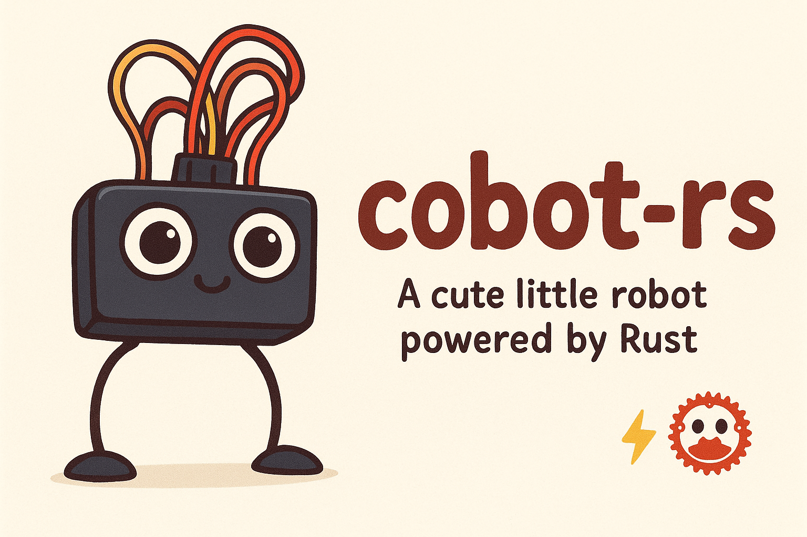

# Cobot-RS

🤖 Cobot-rs

A cute little robot powered by Rust 🦀⚡

Cobot is a small DIY robot project built in Rust, designed to explore robotics, sensors, and fun interactions. With its friendly face and wiggly legs, Cobot makes tinkering with embedded systems both educational and adorable.

## About

An ESP32-based collaborative robot (cobot) project written in Rust for learning embedded systems programming.

This project controls a 4-legged robot equipped with distance sensors. The cobot can be controlled remotely through multiple connectivity options including WiFi, internet, and potentially Bluetooth.

This project serves as a learning platform for:
- Rust programming language
- Embedded systems development
- ESP32 microcontroller programming

## Features

### Hardware
- [ ] 4-leg locomotion system
- [ ] Distance sensor integration
- [ ] ESP32 microcontroller

### Connectivity
- [ ] WiFi control
- [ ] Internet-based remote control
- [ ] Bluetooth support (planned)

### Control Features
- [ ] Basic movement commands
- [ ] Obstacle detection
- [ ] Autonomous navigation
- [ ] Remote monitoring

### Software
- [ ] Rust embedded environment setup
- [ ] Motor control implementation
- [ ] Sensor data processing
- [ ] Communication protocols

## Quick Start

1. **Prerequisites**: Make sure you have the ESP32 Rust development environment set up
2. **Connect**: Connect your ESP32 board via USB
3. **Deploy**: Run the following command to build and flash the firmware:

```bash
cargo run --release
```

This will compile the project, flash it to your ESP32, and start monitoring the serial output.

## Getting Started

For detailed setup instructions, deployment options, and troubleshooting, see the [How to Run Guide](docs/how_to_run.md).

## Hardware Requirements

- ESP32 development board
- 4-leg chassis
- Distance sensors
- Motor drivers
- Power supply

## License

Licensed under the MIT License.